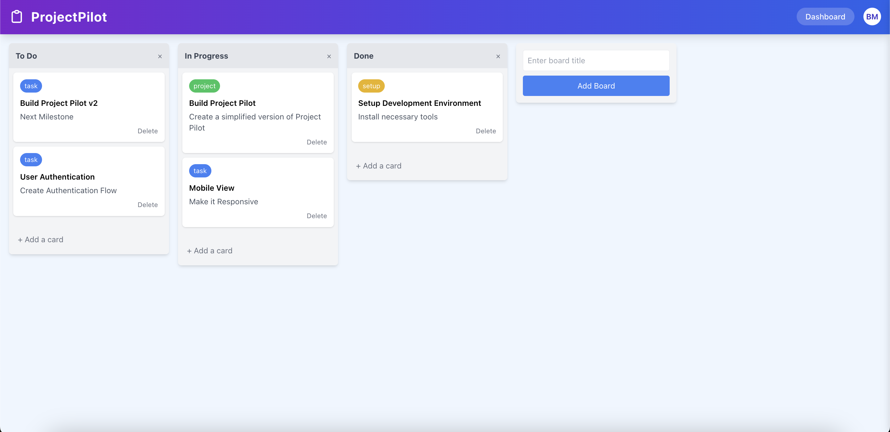

# ProjectPilot

ProjectPilot is a modern, responsive Kanban board application built with React and Tailwind CSS. It provides an intuitive interface for managing projects through a drag-and-drop card system similar to popular project management tools.



## Features

- **Drag and Drop Interface**: Easily move tasks between different stages of your workflow
- **Responsive Design**: Works seamlessly on desktop, tablet, and mobile devices
- **Board Management**: Create, delete, and reorder boards to customize your workflow
- **Task Cards**: Add detailed cards with descriptions and color-coded labels
- **Mobile-Optimized**: Full touch support for drag and drop on mobile devices
- **Modern UI**: Clean, intuitive interface with a gradient color scheme

## Getting Started

### Prerequisites

- Node.js 14.x or higher
- npm 6.x or higher

### Installation

1. Clone the repository:
```bash
git clone https://github.com/yourusername/project-pilot.git
cd project-pilot
```

2. Install dependencies:
```bash
npm install
```

3. Start the development server:
```bash
npm start
```

4. Open your browser and navigate to `http://localhost:3000`

## Project Structure

```
project-pilot/
├── public/
│   └── index.html
├── src/
│   ├── components/
│   │   ├── AddBoardForm.jsx    # Form for adding new boards
│   │   ├── AddCardForm.jsx     # Form for adding new cards
│   │   ├── Board.jsx           # Board component with cards
│   │   ├── Card.jsx            # Individual card component
│   │   ├── Header.jsx          # Application header
│   │   ├── Label.jsx           # Color-coded label component
│   │   └── useMobileDragDrop.js # Custom hook for mobile drag & drop
│   ├── App.js                  # Main application component
│   ├── TrelloClone.jsx         # Core functionality
│   ├── index.js                # Entry point
│   └── index.css               # Global styles with Tailwind imports
└── tailwind.config.js          # Tailwind CSS configuration
```

## Usage

### Creating Boards

Click the "Add Board" button and enter a title for your new board.

### Adding Cards

1. Click the "+ Add a card" button at the bottom of any board
2. Enter a title and description for your card
3. Click "Add" to create the card

### Moving Cards

- **Desktop**: Drag and drop cards between boards
- **Mobile**: Long-press on a card to pick it up, then drag to another board

### Reordering Boards

Use the left and right arrow buttons in the board header to change the order of your boards.


## Browser Support

ProjectPilot supports all modern browsers:

- Chrome (latest)
- Firefox (latest)
- Safari (latest)
- Edge (latest)
- Mobile browsers (iOS Safari, Chrome for Android)

## Roadmap

- User authentication and accounts
- Persistent storage (database integration)
- Card attachments and comments
- Due dates and reminders
- Collaborative editing and sharing

## Acknowledgments

- Inspired by Trello and other kanban-style project management tools
- Built with React and Tailwind CSS
- SVG icons from Heroicons